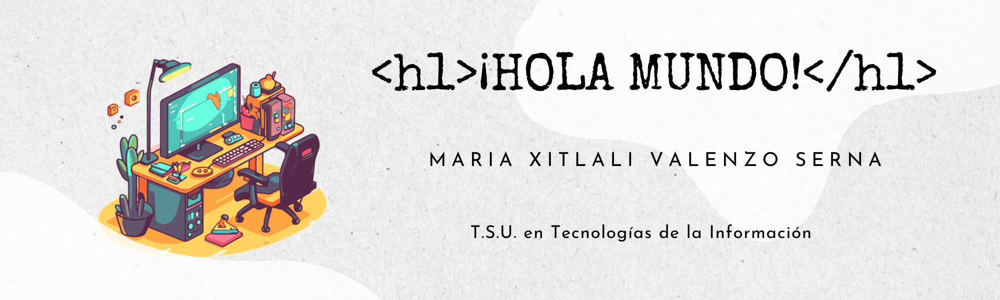

<h1>Hi there 👋</h1>

 

- 👩‍💻 Nombre: Maria Xitlali Valenzo Serna
- 📚 Estatus: Estudiante universitaria de Desarrollo de Software
- 💼 Actualmente trabajando en: IPTE Soluciones
- 🌎 Vivo en: México
- 🎶 Artista fav para escuchar mientras programo: Billie Eilish

<h2>Contacto</h2>
  
   
<h2>Lenguajes</h2>
	
	
	
<!--
**XitlaliValenzo/XitlaliValenzo** is a ✨ _special_ ✨ repository because its `README.md` (this file) appears on your GitHub profile.

Here are some ideas to get you started:

- 🔭 I’m currently working on ...
- 🌱 I’m currently learning ...
- 👯 I’m looking to collaborate on ...
- 🤔 I’m looking for help with ...
- 💬 Ask me about ...
- 📫 How to reach me: ...
- 😄 Pronouns: ...
- ⚡ Fun fact: ...
-->
